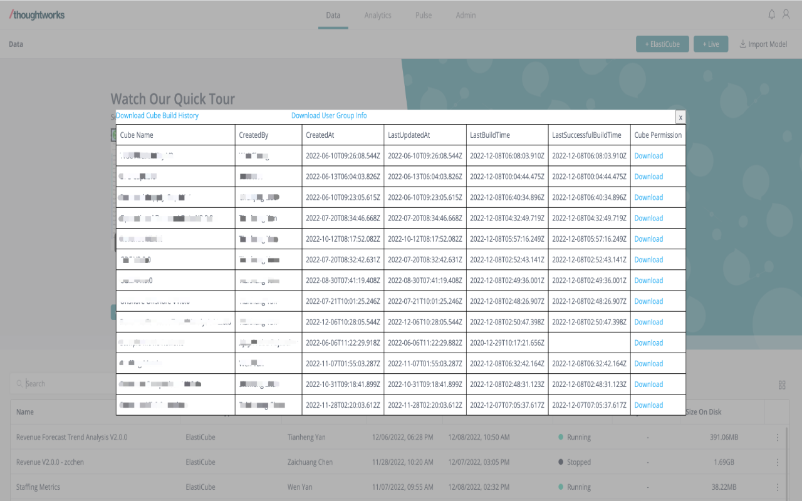

# Sisense Pocket
This repo is a chrome extension to provide extended features in sisense, currently this plugins provide user/group info download, cube build history download, cube permission download, cube details display, more features will be added in later release.

#### How to use it

1. Go to [google web store](https://chrome.google.com/webstore/category/extensions) and search 'Sisense Pocket', you'll see result with icon , then you can install it.

2. In sisense data page, click extension icon , you will see features showed on the page , click again will restore the page.

#### Feedback
I appreciate to receive any feedbacks or pull requests, you can leave your comments in this repo or in the extension homepage or mail to 1158400735@qq.com for any suggestions.

